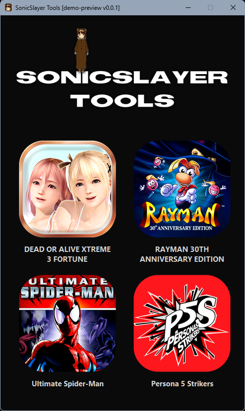

# SonicSlayer Tools


**SonicSlayer Tools** is a graphical toolkit for modifying and extracting assets from multiple games, including Dead or Alive Xtreme 3 Fortune and Rayman 30th Anniversary Edition. The application is built with Python and Tkinter.



## Features

- **KSLT Texture Editor** (DOAX3 Fortune) – open `.kslt` archives, browse DXT5 textures, export/import PNG images, and save modified archives.
- **STRPACK Text Editor** (DOAX3 Fortune) – edit UTF-16LE string tables, search, validate byte length, and save patched binary files.
- **BakesaleTextRepacker** (Rayman 30th) – rebuild `locale.strings` binary from `.txt` files with adjustable header settings.
- **Bakesale Extractor** (Rayman 30th) – graphical front‑end for the external extractor tool.
- **Cowabunga** (Rayman 30th) – graphical front‑end for decrypting/encrypting Digital Eclipse `.pie` archives.
- Modern dark theme, hover animations, and non‑blocking windows (multiple tools can be opened simultaneously).

## Requirements

- Windows 7 or newer (the release is packaged as a standalone `.exe`).
- No Python installation needed for the prebuilt executable.

If you want to run from source:
- Python 3.8+
- Pillow
- numpy

## Installation (Prebuilt Executable)

1. Download the latest `SonicSlayer_Tools.exe` from the [Releases](https://github.com/SonicSlayer/SonicSlayer-Tools/releases) page.
2. Place the following files in the same folder as the executable (optional but recommended for full functionality):
   - `logo.png` – main application logo (width up to 450px)
   - `icon.png`, `icon2.png`, `icon3.png`, `icon4.png` – game card icons
   - `toolsico.ico` – window icon
   - `cowabunga64.exe` – for Cowabunga functionality
   - `BakesaleExtractor.exe` – for Bakesale Extractor functionality
3. Run `SonicSlayer_Tools.exe`.

## Usage

Launch the application. The main window shows game cards. Click a card to open the corresponding toolset.

### DOAX3 Fortune Tools
- **KSLT Texture Modder** – load a `.kslt` archive, select a texture from the left panel, export/import PNG, and save the archive.
- **STRPACK Text Modder** – load a `.bin` string table, edit strings in the table, use the search field, and save the patched file.

### Rayman 30th Anniversary Tools
- **BakesaleTextRepacker** – drop `.txt` files (each line is one string), set language codes, adjust advanced header settings, and generate `locale.strings`.
- **Bakesale Extractor** – provide an input file/directory and optional output directory, then run the external extractor.
- **Cowabunga** – select an input `.pie` file, output file, key preset (or custom hex key), and run decryption/encryption.

All tool windows can be opened simultaneously and do not block the main application.

## Third-Party Tools

This application includes or integrates the following external utilities:

- **Cowabunga** by [Masquerade64](https://github.com/Masquerade64) – [GitHub Repository](https://github.com/Masquerade64/Cowabunga)
- **Bakesale Extractor** by [RayCarrot](https://github.com/RayCarrot) – [GitHub Repository](https://github.com/RayCarrot/BakesaleExtractor)

All other tools (KSLT Editor, STRPACK Editor, BakesaleTextRepacker, graphical front‑ends) are developed by **SonicSlayer**.

## Building from Source

If you wish to build the executable yourself:

1. Clone the repository.
2. Install dependencies: `pip install pillow numpy pyinstaller`
3. Run PyInstaller (example command):
   ```bash
   pyinstaller --onefile --windowed --icon=toolsico.ico --add-data "logo.png;." --add-data "icon.png;." --add-data "icon2.png;." --add-data "icon3.png;." --add-data "icon4.png;." --add-data "toolsico.ico;." sonicslayer_tools.py
   ```

## License

This project is provided for educational and modding purposes. Respect the intellectual property of the respective game publishers. The included third‑party executables are subject to their own licenses.

## Author

SonicSlayer – [GitHub](https://github.com/SonicSlayer)
